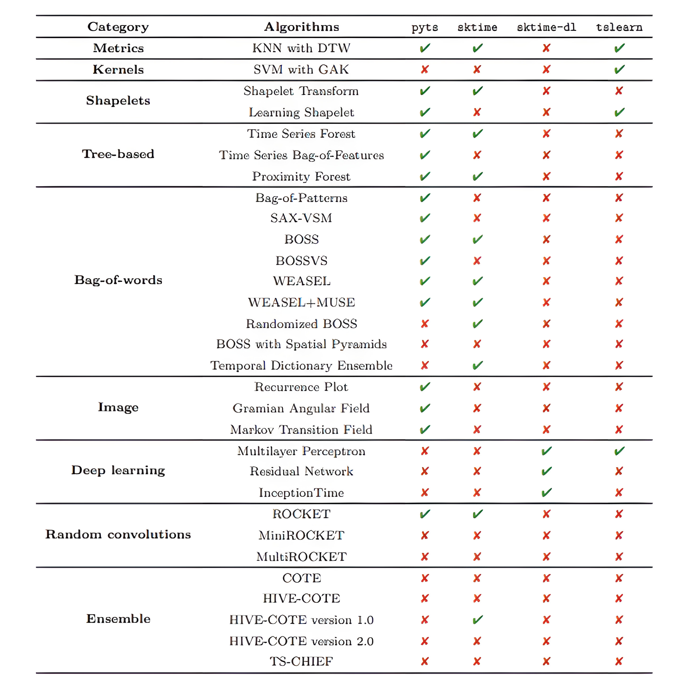

time series classification

- [ECG Heartbeat Categorization Dataset | Kaggle](https://www.kaggle.com/datasets/shayanfazeli/heartbeat)

- [Neymark - TSC | Kaggle](https://www.kaggle.com/competitions/neymark-tsc/data?select=train_y.npy)

packages:

- tslearn: [tslearn’s documentation &#8212; tslearn 0.5.3.2 documentation](https://tslearn.readthedocs.io/en/stable/index.html#)

- sktime: [Welcome to sktime &#8212; sktime documentation](http://www.sktime.net/en/latest/index.html)

- pyts: [Welcome to pyts documentation! &#8212; pyts 0.12.0 documentation](https://pyts.readthedocs.io/en/stable/index.html)
